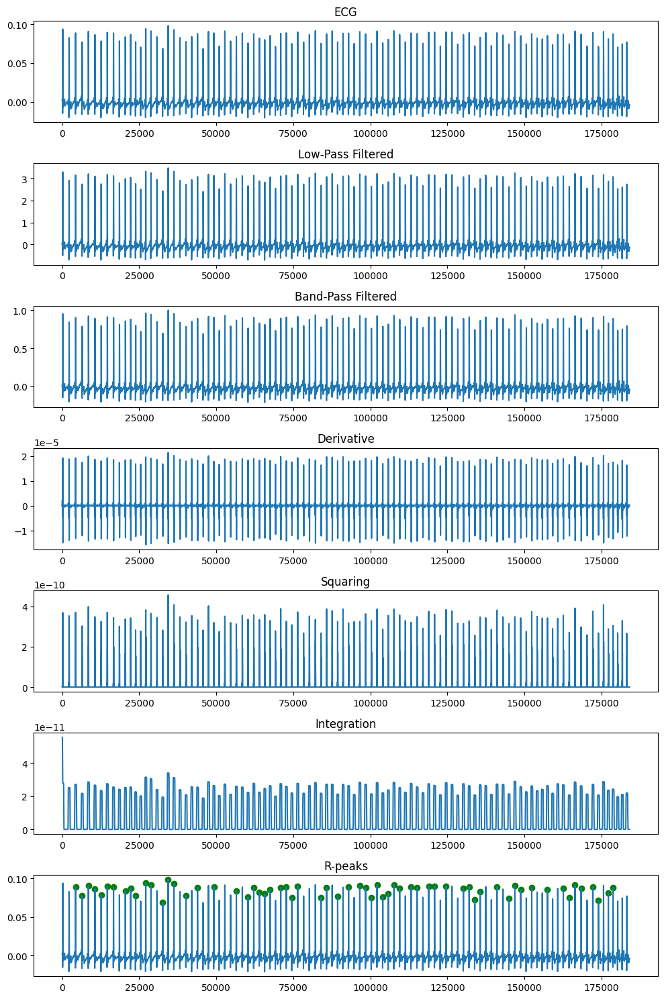
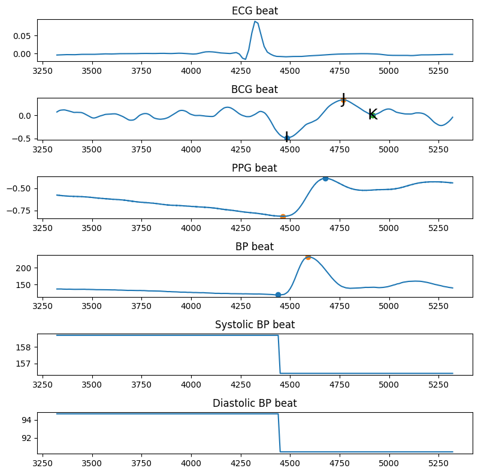

# Pulse Transit Time Calculation
Preprocessing: Apply filters and denoising techniques to preprocess signals such as BCG, PPG, and ECG.

QRS Detection: Detect R peaks in the ECG signal using the Pan-Tompkins algorithm.

Feature Extraction: Extract features from PPG, BCG, BP beat signals such as PPG max-min points, BCG I-J-K waves, and BP max-min points.

PTT Calculation: Calculate Pulse Transit Time (PTT) from finger PPG and BCG signals only.

Prediction: Split the dataset into training and testing sets, create linear regression models for predicting systolic (SBP) and diastolic (DBP) blood pressure, fit the models, and make predictions.

Evaluation: Evaluate the performance of the models by calculating correlation coefficients between predicted and actual blood pressure values.

## Peak Detection

## Feature Extraction of PPG BCG BP

## Results
*  **Activity:** rest initial
  
**Correlation coef DBP:** 0.12406138082002219

**Correlation coef DBP:** 0.6428657418357495

*  **Activity:** Sustained grip challenge stand
  
**Correlation coef DBP:** 0.10937644198120136

**Correlation coef DBP:** 0.10758373537495418

*  **Activity:** rest after grip

**Correlation coef DBP:** 0.14545951884689975

**Correlation coef DBP:** 0.24806714560631574

*  **Activity:** Mental AR stand
 
**Correlation coef DBP:** 0.04717517545037028

**Correlation coef DBP:** 0.1951736144204498

*  **Activity:** rest after mental

**Correlation coef DBP:** 0.2132245038756711

**Correlation coef DBP:** 0.14794019466123495

*  **Activity:** Cold Pressor stand

**Correlation coef DBP:** 0.25759302738916035

**Correlation coef DBP:** 0.2820411009945876

*  **Activity:** rest after cold pres
 
**Correlation coef DBP:** 0.2068934718538918

**Correlation coef DBP:** 0.11037554158538519

*  **Activity:** Valsalva Maneuver stand

**Correlation coef DBP:** 0.8766062337874498

**Correlation coef DBP:** 0.9686279907979932

*  **Activity:** rest after Valsalva
 
**Correlation coef DBP:** 0.3106200023387146

**Correlation coef DBP:** 0.4663564861955781

*  **Activity:** Exercise
 
**Correlation coef DBP:** 0.6883412549222645

**Correlation coef DBP:** 0.23040055644799914

## Notes: 

